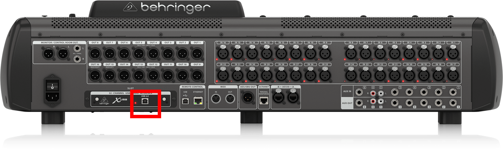
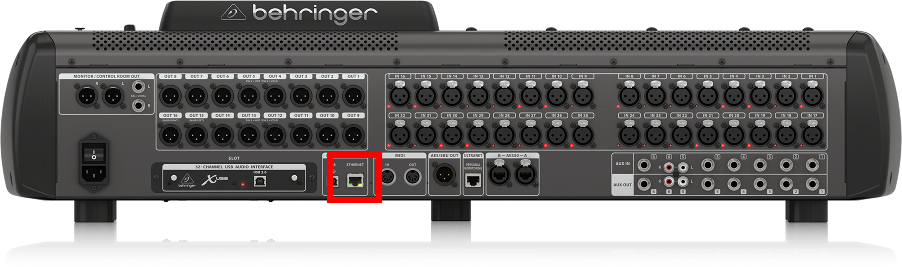
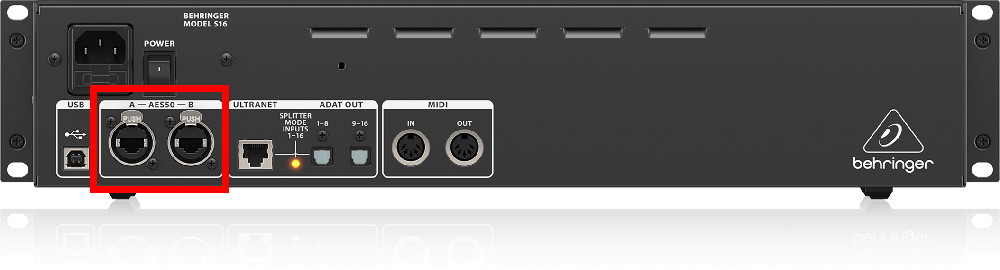
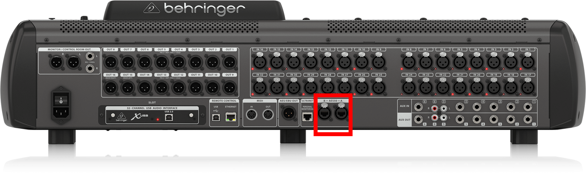
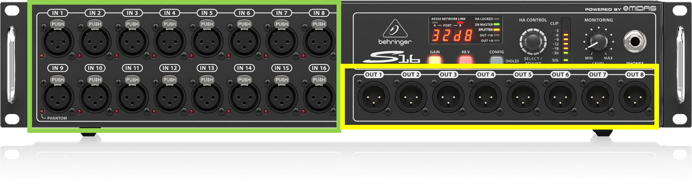
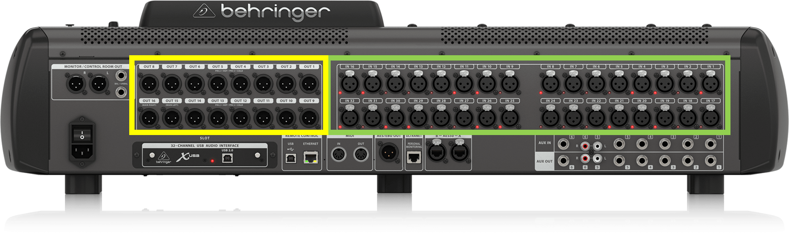
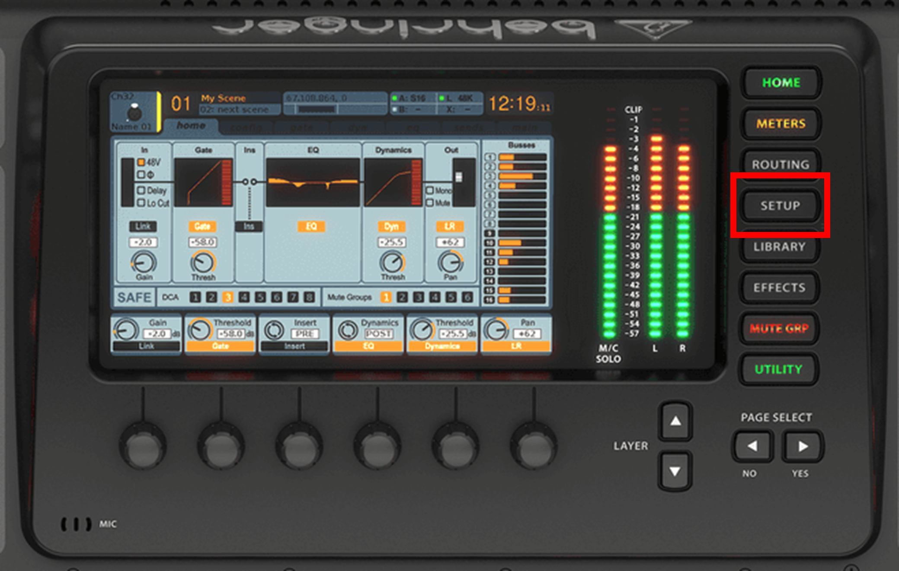

# Anleitung Behringer X32

## Mischpult auspacken

Das Case auf den Tisch stellen und so ausrichten, dass der Schriftzug “THON” oben links in der Ecke steht.

Den Deckel vom Case abnehmen und das Mischpult auf dem Boden des Cases stehen lassen

## Mischpult anschließen

Kalte Geräte Kabel ist bereits am Mischpult angeschlossen und muss in eine 6er Mehrfachsteckdose hinter dem Pult angeschlossen werden

--WICHITG: NOCH NICHT EINSCHALTEN--

USB-A auf USB-B an Mischpult und Ton Notebook anschließen

Asus Router an den Strom hängen und LAN1 (Router) mit der Ethernet Buchse des Mischpultes verbinden

### Stagebox?

Stagebox: JA

- Stagebox im hinteren Teil der Bühne oder nach Plan aufstellen.

- Ethercon / Ethernet Kabel von der Stagebox bis zum Mischpult legen und anschließen

- Stagebox: AES50-A oder AES50-B | Mischpult: AES50-A oder AES50-B

- Input Geräte nach Plan an die Inputs (Grün) anschließen

Output Geräte nach Plan an die Outputs (Gelb) anschließen

Stagebox: NEIN

- Input Geräte nach Plan an die Inputs (Grün) anschließen

- Output Geräte nach Plan an die Outputs (Gelb) anschließen

## Anschalten – Achtung Reihenfolge

Mischpult

Die Geräte in Reihenfolge welches als erstes mit dem Mischpult verbunden ist (Kabelweg)

## Abschluss

IP-Adresse des Pultes überprüfen

Neben dem Display auf den Button „Setup“ klicken

Mit den Pfeiltasten (PAGE SELECT) nach rechts (YES) klicken, bis man auf der „Network“ Seite ist.

Die erste IP-Adresse sollte mit 10.x.x.x, 192.x.x.x, 172.x.x.x beginnen.

## FAQ

### IP-Adresse stimmt nicht?

LAN-Kabel am Mischpult rausziehen, 10sek. Warten und wieder reinstecken. Nach Kurzer Zeit sollte das Pult eine richtige IP bekommen. Ist dies nicht der Fall an einen der Techniker wenden.
